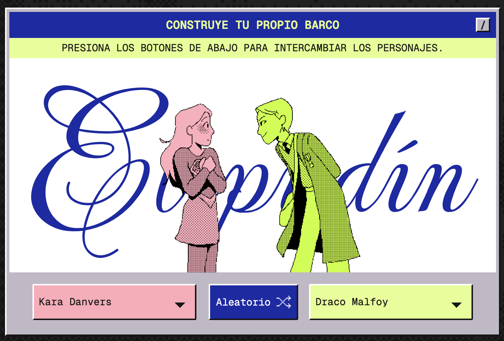

# Análisis de Webstory #
## Parejas de Fanfiction ##
[Thepudding.com](https://pudding.cool/2024/10/fanfic/)

----
* Lo que estas historias tratan de averiguar a través del análisis recolectado de datos del AO3, es por qué todo un grupo de personas está de acuerdo de “shippear” [implicación a anhelo de los fans hacia un romance real o no de los personajes de una obra de ficción, o personas reales] 
Para ello buscan las similitudes dentro de los fanfics más famosos y deciden analizar las tres tendencias que encuentran, una de ellas es que la mayoría son ships entre hombres, la otra es que son parejas no canónicas o que existen fuera de la historia original y por últimos 2 de los 20 mejores son fanfics de personas reales. 

---
*  A través de estos temas separan las páginas por capítulos horizontales que uno puede seleccionar según el orden que desea abordar. Gracias a la profundización de análisis de las categorías mencionadas tratan de explicar por qué se dan esas tendencias. Al final luego de un análisis tanto de los mayores fandom, fanfic y  datos demográficos de los autores y lectores se llegó a la conclusión de que las obras con mayores fandoms como Marvel o Harry Potter tenía mayor representación masculina y la femenina o era en menor medida o era objeto de sexulización. En cambio, el gran porcentaje de autores de AO3 son mujeres. Es así que se llegó a la conclusión de que los fanfics responden a un deseo en su mayoría de mujeres de ver dos hombres apuestos juntos, donde se puedan mostrar su lado vulnerable, un espacio que en sus películas de origen por la época o por su género no se daban estas relaciones homosexuales. Por lo que los fanfics desafían los estigmas sociales y convencionales de las relaciones amorosas y sexuales.
* Me pareció interesante el enfoque visual y cómo organizaron todos los datos de una forma amigable con el lector y con un buen equilibrio entre datos y textos. Por ejemplo, todo el diseño es como si fuera un computador o videojuego donde los datos se presentan a través de tablas y con colores diferentes que se iluminan según la categoría que se esté explicando, lo cual ejemplifica a la vez que se entrega la información.

---
* Además, se observa una gran interacción con el usuario desde el principio donde hay un segmento para emparejar a las parejas que quieras y luego en las tablas de datos puedes ir clickeando para ver las conexiones entre las parejas de los universos de Harry Potter y Marvel. También utilizan jerga muy juvenil para referirse a los ships como “subirse al barco” lo cual hace simpatizar con el usuario y crear una conexión. 
* Por último, me gustaría destacar la tipografía del título en cursiva que alude a las cartas antiguas de amor y el uso de colores para destacar distintos temas o dar énfasis a los datos o palabras claves. 
Es por esto que pienso que se logró transmitir con eficacia la información, pero aún así siento que se podría mejorar, pues a veces se hacía mucho uso de abreviaturas o uso de jergas de los lectores que no todos conocen. 
